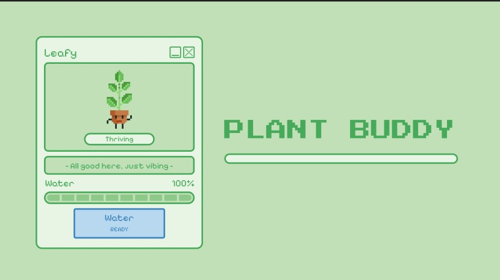

> A small interactive desktop plant companion that turns plant care into a simple, playful experience.

**Plant Buddy** is an interactive desktop application where users take care of a virtual plant by keeping its water level healthy. The plant visually changes its mood depending on its water level, creating a simple game-like plant-care mechanic.

---

## ✨ Features

* 🌱 **Dynamic Plant States**

  * Thriving
  * Okay
  * Thirsty
  * Wilted

* 💧 **Watering System**

  * Water the plant to increase its water level
  * Each watering restores 25% water
  * A cooldown prevents continuous watering

* 📊 **Water Level Meter**

  * Real-time percentage indicator
  * Visual segmented water bar

* 🌿 **Animated Plant States**

  * Different animations are displayed based on the plant's condition

* 🔄 **Restart Mechanic**

  * Reset the plant after it completely wilts

* 🖥️ **Desktop Application**

  * Built with Electron
  * Custom application-style interface

---

## 🎮 How It Works

The plant starts with **100% water**.

The water level gradually decreases over time.

Depending on the remaining water level, the plant changes its state:

| Water Level | State       |
| ----------- | ----------- |
| 75–100%     | 🌱 Thriving |
| 40–74%      | 🌿 Okay     |
| 1–39%       | 🥀 Thirsty  |
| 0%          | 💀 Wilted   |

Clicking **Water** increases the water level by 25%.

After watering, the button enters a short cooldown before it can be used again.

Once the plant reaches 0%, the user can restart the plant and begin again.

---

## 🛠️ Built With

### Frontend

* HTML
* CSS
* JavaScript

### Desktop Framework

* Electron

### Other

* Pixel-art plant animations
* Custom UI components
* JavaScript timers and state management

---

## 🚀 Getting Started

### Prerequisites

Make sure you have **Node.js** and **npm** installed.

### 1. Clone the repository

```bash
git clone https://github.com/Koder02/plant-buddy.git
```

### 2. Enter the project directory

```bash
cd plant-buddy
```

### 3. Install dependencies

```bash
npm install
```

### 4. Start the application

```bash
npm start
```

The Plant Buddy desktop application should open automatically.

---

## 🧠 What I Learned

This project helped me explore how simple JavaScript state management can be used to create an interactive experience.

Some of the concepts explored include:

* Managing application state
* Updating the UI dynamically
* JavaScript timers
* Event handling
* Button cooldown logic
* Conditional UI states
* Electron desktop application structure
* Creating a playful interaction around a simple system

---

## 🔮 Future Ideas

Some ideas I may explore in future versions:

* 🌱 Multiple plant species
* ☀️ Sunlight and temperature mechanics
* 🪴 Plant growth stages
* 🏆 Daily care streaks
* 💾 Persistent plant state
* 🔔 Desktop notifications
* 🎵 Small ambient sound effects

---

⭐ If you found this project interesting, feel free to explore the repository and check out my other creative coding experiments.
